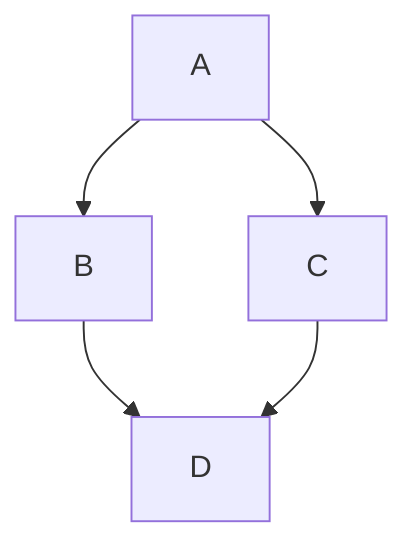

**Mermaid** – векторные диаграммы, которые можно вставить непосредственно в документацию (cервис поддерживает команда энтузиастов во главе с Кнутом Свейдквистом).

Чтобы добавить диаграмму в .md-файл, нужно включить ее код в текст. 
Блок начинается со строки «```mermaid» и завершается тремя обратными апострофами – «```».

|= sdf|=2
|1|2

#|
||sdf|sdsd||
|#



graph TD;
  A-->B;
  A-->C;
  B-->D;
  C-->D;


Когда **парсер markdown-файлов** (с расширением .md) находит помеченные блоки кода, 
он создает объект типа **iframe** – аналогичным способом на странице вставляется видео с YouTube и другие интерактивные элементы. 
Код передается **сервису Mermaid.js**, который превращает его в диаграмму в локальном браузере – на стороне пользователя. 
При этом **задействуется и HTML-конвейер GitHub, и внутренняя служба рендеринга файлов Viewscreen**.

Можно загрузить файл. Плагин распознает тело блока и заменит его сгенерированной SVG-диаграммой в формате Base64. 



https://infostart.ru/journal/news/tekhnologii/v-github-dobavili-podderzhku-diagramm_1611703/
https://mermaid.js.org/ecosystem/integrations-community.html
https://github.com/JozoVilcek/gitbook-plugin-mermaid

https://github.com/miao1007/gitbook-plugin-mermaid-cli


f--b


