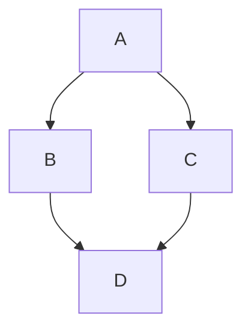

**Mermaid** – векторные диаграммы, которые можно вставить непосредственно в документацию (cервис поддерживает команда энтузиастов во главе с Кнутом Свейдквистом).

Чтобы добавить диаграмму в .md-файл, нужно включить ее код в текст. 
Блок начинается со строки «```mermaid» и завершается тремя обратными апострофами – «```».



Когда **парсер markdown-файлов** (с расширением .md) находит помеченные блоки кода, 
он создает объект типа **iframe** – аналогичным способом на странице вставляется видео с YouTube и другие интерактивные элементы. 
Код передается **сервису Mermaid.js**, который превращает его в диаграмму в локальном браузере – на стороне пользователя. 
При этом **задействуется и HTML-конвейер GitHub, и внутренняя служба рендеринга файлов Viewscreen**.

